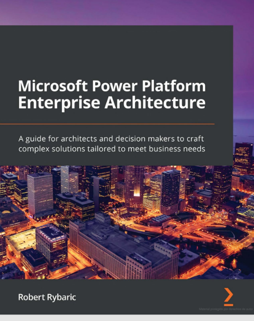
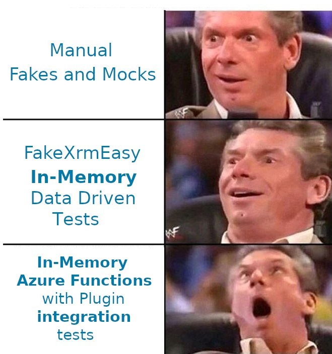

# Azure Functions, FakeXrmEasy, Dataverse, and dotnet core
### Jordi Montaña

---

---

# ABOUT ME

## Jordi Montaña

- Began coding at **10 yrs old**
- **.Net** in 2006
- Master's Degree in Computer Science, **Universitat Politècnica Catalunya (UPC)**, 2007
- Started with **CRM 4** in 2011
- Author of **FakeXrmEasy** since 2014
- Founded **DynamicsValue** in 2015
 

---

# SOCIAL MEDIA

- Twitter: [https://twitter.com/jordimontana](https://twitter.com/jordimontana)

- LinkedIn: [https://es.linkedin.com/in/jordimontana](https://es.linkedin.com/in/jordimontana)

- Email: [jordi@dynamicsvalue.com](jordi@dynamicsvalue.com)

---

# TALK LINKS

- Slides: [https://github.com/DynamicsValue/bizzsummit-es-2022](https://github.com/DynamicsValue/bizzsummit-es-2022)

- Sample code: [https://github.com/DynamicsValue/fake-xrm-easy-samples](https://github.com/DynamicsValue/fake-xrm-easy-samples)

- FakeXrmEasy Docs: [https://dynamicsvalue.github.io/fake-xrm-easy-docs/quickstart/](https://dynamicsvalue.github.io/fake-xrm-easy-docs/quickstart/)

---

# AGENDA

- The Journey of **FakeXrmEasy (FXE)**
- Why?
- Evolution of Unit Testing in Dynamics / Dataverse
- The new Dataverse Client SDK, and new FXE versions
- Demo
- OSS Licensing Considerations
- Q & A

---

# Journey of FakeXrmEasy (FXE)

In 2013 I was told...

- "Unit testing is **too complex**, **too time consuming**"
- "It's xRM man, **no one cares** about **quality** of the software"
- "Not **worth** it"

---

# Journey of FakeXrmEasy (FXE)

... but what if it's **complex BECAUSE** ... 

- you're **mocking every single request, every time?**
- and mocks don't actually **mimic Dataverse / Dynamics behavior?**
- and the code for mocking is actually **bigger** than, say, **plugin** code?
- and **maybe thay's WHY is not worth it?**...

---

# Journey of FakeXrmEasy (FXE)

... and so ... **what IF** ... 

- you **didn't** have to mock anything (and it was **done for you?**)
- you could just use the **IOrganizationService** (something you're already **familiar** with?)
- it could **mimic Dataverse / Dynamics** behavior?
- more like **data-driven**, like when you doing **normal development?**

---

# Journey of FakeXrmEasy (FXE)

... and **SO** we could...  

- **reduce costs** because we could spot **issues** much **earlier**?
- run **thousands** of tests **at scale**? (because they run **In-Memory**)
- **speed-up the dev process** because **no need to deploy** in-between changes?

---

# Journey of FakeXrmEasy (FXE)

... and **so** In 2014 I **started working on FakeXrmEasy**...  

**YET**, **for a couple of YEARS** I was....

- working pretty much alone as a single contributor, **and**
- repeatedly told...  ..... guess what??

---

# Journey of FakeXrmEasy (FXE)

... the **SAME** :)  

- "It's xRM man, **no one cares** about **quality** of the software"
- "Not **worth** it"
- "You're **wasting your time** man..."

---

# Journey of FakeXrmEasy (FXE)

**BUT**, things started to change...  

- Met Raz and delivered (my first) **CRM Saturday** talk in Manchester, 2016
- There **were 4 people** attending
- Yes, you read that right :)

---

# Journey of FakeXrmEasy (FXE)

**Next CRM Saturday in London**:   

- Over **100 attendees**...

---

# Journey of FakeXrmEasy (FXE)

**Following CRM Saturday events**:   

- Zurich (Switzerland)
- Dubai (UAE)
- Manchester (UK)
- Madrid and Barcelona (Spain)
- Dallas, Texas (US)
- Kyiv (Ukraine)
- ...

---

# Journey of FakeXrmEasy (FXE)

**TODAY**, more than **7 YEARS** later...   

### FakeXrmEasy Use : 2M downloads !
- **2 M+ downloads**: [https://www.nuget.org/packages?q=FakeXrmEasy](https://www.nuget.org/packages?q=FakeXrmEasy)

- ~ 20% of **Microsoft Crm Sdk** downloads
- Used in **multi-million** dollar projects (many Fortune 100s included)

---

# Journey of FakeXrmEasy (FXE)

### FakeXrmEasy in books

---

# Journey of FakeXrmEasy (FXE)

### FakeXrmEasy in books

---

# Journey of FakeXrmEasy (FXE)

### FakeXrmEasy in books

---

# Journey of FakeXrmEasy (FXE)  

### FakeXrmEasy on official MSFT Docs

https://docs.microsoft.com/en-us/power-apps/developer/data-platform/testing-tools-server

---

# Journey of FakeXrmEasy (FXE) 

### FakeXrmEasy on Research Gate

"Challenges and Opportunities in Low Code Testing"

https://www.researchgate.net/publication/347478419_Challenges_opportunities_in_low-code_testing

---

# Journey of FakeXrmEasy (FXE)

### FakeXrmEasy as a LinkedIn skill

---

# Journey of FakeXrmEasy (FXE)
  
### FakeXrmEasy as a LinkedIn skill

---

# Journey of FakeXrmEasy (FXE)
  

### FakeXrmEasy as a LinkedIn skill

---

# Journey of FakeXrmEasy (FXE)

### Even JOBS asking for FakeXrmEasy exp...

---

# Journey of FakeXrmEasy (FXE)

### Even JOBS asking for FakeXrmEasy exp...

---

# Journey of FakeXrmEasy (FXE)
  
### And, finally, happy customers ... 

- [https://dynamicsvalue.com/customer-stories](https://dynamicsvalue.com/customer-stories)

---

# Moral of the Story ...

### Don't listen to naysayers
### Be consistent   

---

# Why?

## Increased developer efficiency

https://dynamicsvalue.com/white-paper

---

# Why?

---

## Evolution of Unit Testing in Dataverse

---

# DEMO

## Scenario

- A contact is created via an azure function
- A plugin triggers to create a follow up task activity

---

# DEMO

## Scenario

FXE v3 => Dataverse Client SDK in .net core
FXE v2 => Microsoft.CrmSdk.CoreAssemblies

- 1) Azure function unit tests (FXE **3**.2.0)
- 2) Plugin unit tests (FXE **2**.2.0)
- 3) Pipeline Simulation (FXE **3**.2.0)

---

# OSS Licensing Considerations

## Triple license model

- **Reciprocal Public License 1.5**: OSI - Approved OSS license
- **Modified PolyForm NonCommercial 1.0.0**
- Commercial (**EULA**)

---

# OSS Licensing Considerations

Basically you can use **FakeXrmEasy free of charge**:

- In **OSS** projects, and / or
- For a **Non-commercial use** and / or 
- As part of a **Non-Commercial organization**

---

# OSS Licensing Considerations

- You'll need a **commercial** license for **propietary code and commercial use**.

- **Pricing**: [https://dynamicsvalue.com/pricing](https://dynamicsvalue.com/pricing)

- **No brainer**: **~ 0,88 coffees / developer / day**

- **FAQ**: [https://dynamicsvalue.github.io/fake-xrm-easy-docs/licensing/faq/](https://dynamicsvalue.github.io/fake-xrm-easy-docs/licensing/faq/)

---

# OSS Licensing Considerations

Reciprocal Public License (RPL 1.5) is **NOT** new:

- **DuendeSoftware** (authors of IdentityServer)
- **NServiceBus**

---

# OSS Licensing can be quite complex....

## Question: Is .net core OSS ??

---

# OSS Licenses major companies love ...

- **Permissive**: MIT (Expat), Apache 2.0
- **Weak copyleft**: GPL-like (GPL, LGPL, ...)

---

# OSS Licenses major companies don't love so much...
### ... and that they are key to sustainability
- Pretty much **anything different**...

- AGPL 3.0 (Affero General Public License 3.0)
- RPL 1.5
- **THE comprehensive list**: https://spdx.org/licenses/

---

# Thank You! 

## Q & A

#### By asking a question you're agreeing to the Beer-Ware License ;)

https://spdx.org/licenses/Beerware.html

